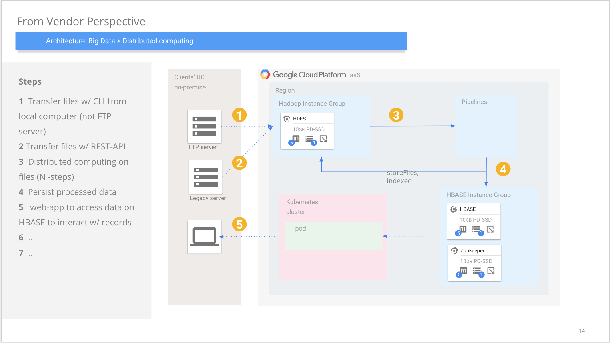

# bigdata-boilerplate

this boilerplate is prepared for some of the real-case scenarios such as, clients sends files to your side, then you use these files for distributed computing (some signing, validation etc. w. spark or beam), web-app for search and some state managements (approve/reject records)

to simulate on-premice on cloud, **leveraged GCP IaaS**!

- [x] production ready (full distributed)
- [x] on-premice (creates servers on GCP so uses GCP CLI -> replace w/ _ansible_ need)
- [ ] some network adjustments missing (seperate subnet masks, firewall configs, additional DNS servers, switches etc...)
- [ ] central zookeeper management (questionable)
- [ ] hdfs
- [ ] hbase + zookeeper
- [ ] kafka + zookeeper
- [ ] beam
- [ ] spark
- [ ] airflow (to coordinate some file related tasks)

### High Level Architecture -

#### Notes
- on cloud, you have opportuniets to decrease _operational costs_ w/o using IaaS. 
- only HDFS used in Hadoop. Distributed computing should be done by spark or beam. Not Hadoop's map/reduce
- consider also Mesosphere on your DC to manage these big data stack.

