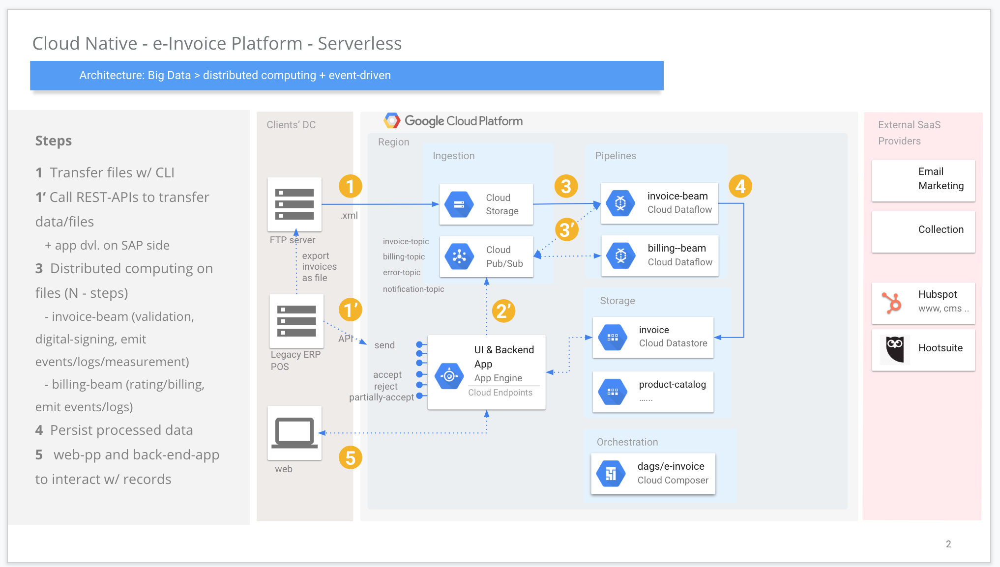

# e-invoice platform

this boilerplate is prepared for e-invoice platform's POC of critical parts on GCP.

**POC scope**
- [x] sample invoice files-2-gcp
- [x] handle distributed computing on beam
    - [x] basic validations
    - [x] persist to datastore
- [x] Performance tests
- [ ] APIs w/ spring+gradle
- [ ] web-app prototype w/ skecth
- [ ] web-app w/ spring+gradle

then prototype, then MVP should be done.

### High Level Architecture - e-invoice

